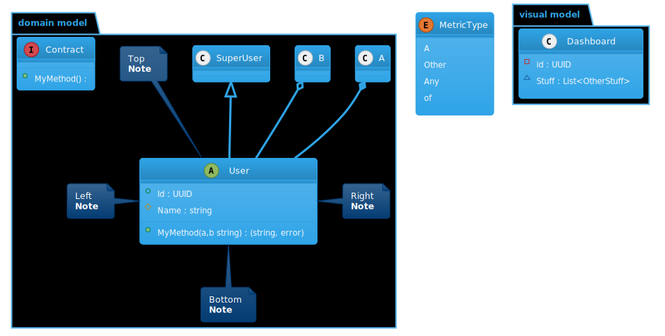

# plantuml

Usage Example
```go
package main

import . "github.com/golangee/plantuml"
import "fmt"

func main(){
  fmt.Println(String(NewDiagram().
		Include(ThemeCerulean).
		Add(NewPackage("visual model").
			Add(NewClass("Dashboard").
				AddAttrs(
					Attr{Private, false, false, "id", "UUID"},
					Attr{PackagePrivate, true, false, "Stuff", "List<OtherStuff>"},
				),
			),
			NewPackage("domain model").
				Add(NewClass("A"),
					NewClass("B"),
					NewClass("SuperUser"),
					NewAbstractCLass("User").
						AddAttrs(
							Attr{Public, false, true, "Id", "UUID"},
							Attr{Protected, true, true, "Name", "string"},
							Attr{Public, false, false, "MyMethod(a,b string)", "(string, error)"},
						).
						Extends("SuperUser").
						Owns("A").
						Uses("B").
						NoteLeft(NewNote("Left\n<b>Note</b>")).
						NoteTop(NewNote("Top\n<b>Note</b>")).
						NoteRight(NewNote("Right\n<b>Note</b>")).
						NoteBottom(NewNote("Bottom\n<b>Note</b>")),
					NewInterface("Contract").
						AddAttrs(Attr{Public, true, false, "MyMethod()", ""}),
				),
			NewEnum("MetricType", "A", "Other", "Any", "of"),
		),
	))
}
```

Results in an output like this


